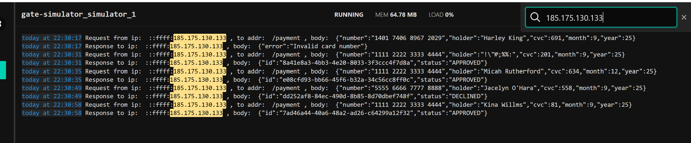

# Отчетные документы по итогам тестирования функции покупки тура на сайте http://localhost:8080/

Проведено тестирование функции покупки тура на сайте http://localhost:8080/ посредством оплаты по карте и офрмлением в кредит. Проведена автоматизаиция функции покупки тура на сайте http://localhost:8080/ посредством оплаты по карте.

Подготовлено и отработано 15 тест-кейсов, из которых 12 отработаны успешно (80%) и 3 неуспешно (20%). Позитивные тест-кейсы - 3 шт - отработаны успешно.

В результате тестирования выявлено, что поле Владелец не проходит валидацию. Поле Владелец предполает заполнение только латинскими буквами, но при заполнении поля Владелец кириллицей, цифрами и специальными символами, система принимает заявку. Рекомендации: утановить в поле Владелец ограничение на заполнение только латинскими буквами.

