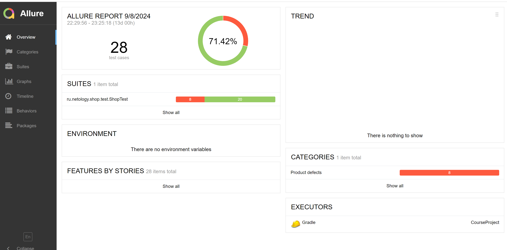

# Отчетные документы по итогам автоматизации функции покупки тура на сайте http://localhost:8080/

Запланирована автоматизация функции покупки тура на сайте http://localhost:8080/ посредством оплаты по карте. Проведена автоматизаиция функции покупки тура на сайте http://localhost:8080/ посредством оплаты по карте.

Реализован DataHelper класс с подключением к библиотеке Faker и использованием стандартного класса LocalDate. Заполнение данных карты с помощью DataHelper вынесено в отдельный класс PayPage.

Отчеты по прохождению автотестов формируются через Allure.

Отсутствие тестовых селекторов на исследуемых страницах привело к значительному увелечению времени на написание сценариев автоматизации. Обращение к полям идет последовательно через поиск по общему классу .input__control, что в дальнейшем несет следующие риски: при перемене мест полей их заполнение будет неккоректным.

На автоматизацию было потрачено 20 часов, что превышает запланированное значение - 12 часов, и связано с подбором селекторов для обращения к полям, а также наиболее оптимальным генерированием данных для заполнения полей Месяц и Год.

